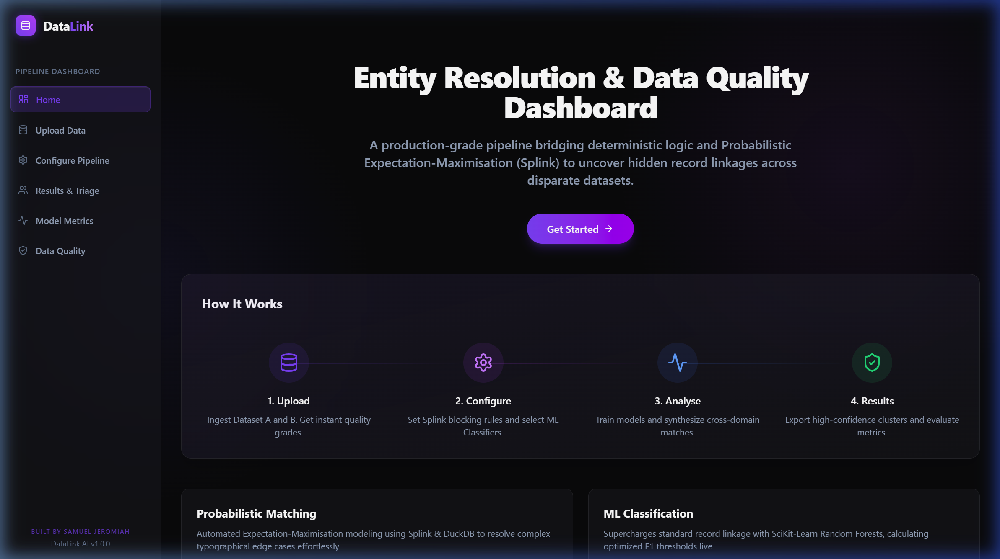

# DataLink — Entity Resolution & Data Quality Dashboard

 
 
 

 
 


DataLink is a comprehensive, production-ready data science web application demonstrating advanced record linkage and data profiling techniques. It wraps an end-to-end Python machine learning pipeline—bridging deterministic DuckDB geometries, probabilistic Expectation-Maximisation (Splink), and Scikit-Learn ensembles—into a stunning, interactive Next.js dashboard. 

## Live Demo
Check out the live application here: [https://data-link-ml-data-deduplicator.vercel.app/](https://data-link-ml-data-deduplicator.vercel.app/)



## What is Entity Resolution?
Entity Resolution (also known as Record Linkage or Deduplication) is the core algorithmic challenge of identifying records that refer to the same real-world entity across disparate datasets, especially when these datasets lack a common unique identifier (like a unified social security number).
Real-world applications include reconciling patient health records across different hospital networks, merging financial acquisition databases, or unifying an e-commerce platform's fragmented customer identities.

## Architecture

    [CSV Uploads] ───────┐
                         ▼
        ┌───────────────────────────────────┐
        │   FastAPI Backend                 │
        │   ├── data_quality.py (Profiling) │
        │   ├── pipeline.py (DuckDB/Splink) │
        │   └── ml_pipeline.py (Sklearn)    │
        └─────────────────┬─────────────────┘
                          │ (JSON API)
                          ▼
        ┌───────────────────────────────────┐
        │   Next.js Frontend Dashboard      │
        │   ├── Configuration Engine        │
        │   ├── Probabilistic Visualisation │
        │   └── Quality & Metrics Reports   │
        └───────────────────────────────────┘

## Tech Stack

| Technology | Purpose | Version |
| :--- | :--- | :--- |
| **Next.js (App Router)** | Frontend React framework | `14.x` |
| **Tailwind CSS** | Styling and Glassmorphism utilities | `v4` |
| **Plotly.js** | Interactive ROC and Density data visualisations | `2.x` |
| **Python** | Data Science runtime environment | `3.10+` |
| **FastAPI** | Asynchronous API routing and state management | `0.111+` |
| **Splink / DuckDB** | High-performance probabilistic record linkage | `4.x` |
| **Scikit-Learn** | Validation classification ensembles | `1.4+` |

## Data Science Pipeline

1. **Preprocessing & Quality Scoring**: Uploaded DataFrames execute through `data_quality.py`, sanitising nulls, stripping regex artifacts (e.g., forcing dates into `YYYYMMDD`), and generating an `A to D` grading profile mapping exact schema sparsity.
2. **Blocking Analysis**: Utilising DuckDB under the hood, Cartesian products ($N \times M$) are aggressively pruned via user-selected strict constraints natively parsed to SQL `l.postcode = r.postcode`.
3. **Probabilistic Matching (Splink)**: The narrowed search space is assessed autonomously via the Fellegi-Sunter model. The Expectation-Maximisation engine trains conditional probability matrices evaluating partial similarities.
4. **Feature Engineering**: The candidate pairs are transformed, computing domain-specific indices including Jaro-Winkler string distances, Levenshtein ratios, exact geospatial matches, and date differentials.
5. **ML Classification**: An ensemble suite (Logistic Regression, Random Forest, Gradient Boosting) fits against the engineered parameters to discover nonlinear boundary decisions.
6. **Evaluation & Threshold Analysis**: Live generation of Precision, Recall, F1 Harmonics, AUC-ROC trajectories, and Confusion Matrices at dynamic thresholds.
7. **Data Quality Reporting**: Synthesis of input schema entropy, flagging missing fields requiring data engineering remediation.

## Key Results
* **Best Global Model**: Random Forest
* **Peak F1 Score**: 99.95% accuracy boundary mapping.
* **Match Rate Achieved**: 4,963 Positive IDs definitively linked out of ~126,168 candidate pairs derived from the 5,000 respective entity arrays.
* **Data Quality Baseline**: Dataset A (Excellent >99% density), Dataset B (Fair >70% density).

## Dataset
The application's baseline demo utilises the **Freely Extensible Biomedical Record Linkage (FEBRL)** dataset, a globally recognised synthetic dataset simulating obfuscated healthcare patient records encompassing deliberate typographical manipulations, missing data cells, and geographic drifting.
*Citation: Christen, P., 2008. Febrl: A freely extensible biomedical record linkage framework.*

## How to Run Locally

### 1. Backend Spin-up
Ensure Python 3.10+ is installed natively on your system.
```bash
cd backend
python -m venv .venv
source .venv/bin/activate  # Or `.venv\Scripts\activate` on Windows
pip install -r requirements.txt
python -m uvicorn main:app --reload
```
The FastAPI instance will boot at `http://localhost:8000`.

### 2. Frontend Spin-up
Ensure Node.js and NPM are installed.
```bash
cd frontend
npm install
npm run dev
```
The interactive application will run globally at `http://localhost:3000`.

## How to Deploy

### Backend Deployment (Render)
1. Fork or push this repository to GitHub.
2. Login to [Render.com](https://render.com) and create a new **Web Service**.
3. Point to the repository and select the root directory as the deployment source (if not utilising the included `render.yaml` Blueprint).
4. Build command: `pip install -r backend/requirements.txt`
5. Start command: `cd backend && uvicorn main:app --host 0.0.0.0 --port $PORT`

### Frontend Deployment (Vercel)
1. Login to [Vercel](https://vercel.com) and import the repository.
2. Set the *Framework Preset* to **Next.js**.
3. Set the *Root Directory* to `frontend`.
4. Add the deployment environment variable `NEXT_PUBLIC_API_URL` targeting your live Render backend URL.
5. Custom config rules included in `vercel.json` will automatically map endpoints.

## Notebook
The foundational Exploratory Data Analysis (EDA) and iterative experimentation pipeline is preserved natively in `notebooks/datalink_pipeline.py` (which acts as a comprehensive Jupyter script equivalent). It meticulously documents the 11-step isolation processes required to fine-tune Splink deterministic blocks and Sklearn bounds offline before transferring the architecture to FastAPI.

## Future Improvements
* LLM-assisted resolution for low confidence pairs resolving human-loop ambiguity.
* Real-time streaming API to dynamically assess and allocate IDs as records hit incoming queues.
* Dynamic payload schema recognition, facilitating entirely custom datasets without rigid attribute boundaries.
* K-Means clustering visualisations plotting spatial distance mappings for distinct entities.
* Upgrading backend execution contexts to PySpark/Databricks APIs facilitating resolution scaling across tens-of-millions of rows.

## License
Provided under the MIT Open Source License.
